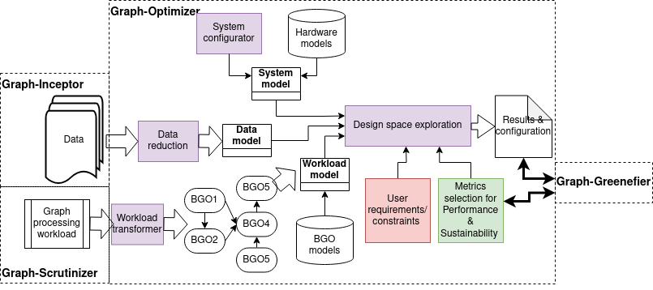
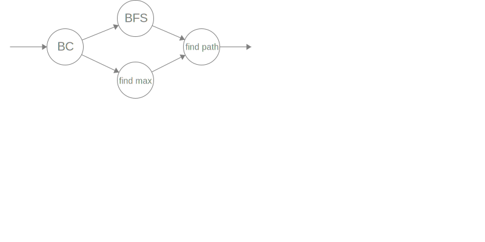

# graph-optimizer
This repository contains the Graph-Optimizer tool, which predicts the execution time and energy consumption of a given BGO or DAG of BGOs on any given hardware configuration. The output of this tool can be used as input to the Graph-Greenifier tool.

## Description
In short, the Graph-Optimizer tool performs the following functions:
- Predicts the execution time (in milliseconds) and energy consumption (in Joules) for a given BGO or DAG of BGOs on a specific hardware configuration.
- Returns the model in symbolical form with graph properties as symbols or predicts execution times if the graph properties are specified.
- This is done via an API where issuing a POST request to `<api_url>/models` with the BGO DAG and hardware configuration returns an annotated DAG with calibrated symbolical models. Calling `<api_url>/evaluate` with the BGO DAG, hardware configuration, and graph properties returns an annotated DAG with predicted execution times.

For more information, check demo/demo.ipynb.

### Architecture Diagram


The functionality of the Graph-Optimizer is shown in the above diagram. The main components of this diagram that the Graph-Optimizer tool provides are the workload model and the design space exploration.

A system model is provided by the user, which includes all hardware information necessary for the Graph-Optimizer tool, including microbenchmarks. This can either be a hypothetical system, or a real system that the user has access to. In case of a real system, `benchmarks/microbenchmarks.py` can be run to obtain the necessary microbenchmark values.

The data model is provided by the Graph-Inceptor tool, which includes a model of the input graph, including metadata and properties of the graph, such as number of vertices, number of edges, diameter of the graph, etc.

The workload model is provided by the Graph-Optimizer tool. For all BGOs in the BGO repository, a performance model and energy model exists within the Graph-Optimizer repository.

In the design space exploration section, the performance and energy models of the Graph-Optimizer tool are combined with the data and system models to predict the performance and energy consumption of the input graph on the given system. This output can be used by the user directly, or as input to the Graph-Greenifier tool. Within the design space exploration, the user can also spicify requirements or constraints, such as a maximum energy consumption, or a maximum execution time.

### Examples

As an example for the workflow of the Graph-Optimizer tool, let us use UseCase 0, which has the following input DAG:



We can use a hypothetical hardware system with the following System model:
```JSON
{
    "hosts": [
        {
            "id": 1,
            "name": "host1",
            "cpus": {
                "id": 1,
                "name": "intel xeon",
                "clock_speed": 2.10,
                "cores": 16,
                "threads": 32,
                "wattage": 35,
                "amount": 2,
                "benchmarks": {
                    "T_int_add": 2.4, "T_float_gt": 0.8,
                    "T_q_pop": 11.2, "T_q_push": 16.1, "T_q_front": 14.5,
                    "T_L1_read": 1.26, "T_L2_read": 4.24, "T_L3_read": 20.9, "T_DRAM_read": 62.5,
                    "L1_linesize": 64, "L2_linesize": 64, "L3_linesize": 64,
                    "T_heap_insert_max": 52.7, "T_heap_extract_min": 123.3, "T_heap_decrease_key": 12.7,
                    "T_push_back": 12
                }
            }
        }
    ]
}
```

And an input graph with the following data model:
```JSON
{
    "n": 15763,
    "m": 171206,
    "average_degree": 21,
    "directed": False,
    "weighted": False,
    "diameter": 7,
    "clustering_coefficient": 0.0132526,
    "triangle_count": 591156,
    "s": 1000
}
```

The input DAG is represented as the following JSON object:
```JSON
[
    {
        "id": 0,
        "name": "bc",
        "dependencies": []
    },
    {
        "id": 1,
        "name": "find_max",
        "dependencies": [0]
    },
    {
        "id": 2,
        "name": "bfs",
        "dependencies": [0]
    },
    {
        "id": 3,
        "name": "find_path",
        "dependencies": [1,2]
    }
]
```

The performance and energy models of these BGOs can be found in the `models` directory.

Running the Graph-Optimizer prediction api (using `flask --app api/api.py run` from the home directory) and issuing a POST request to `localhost:5000/models` with the following post data:
```JSON
{
    "hardware": "<system model>",
    "input_dag": "<input DAG>",
    "graph_props": "<input graph data model>"
}
```
returns an annotated DAG with the estimated runtimes and energy prediction as follows:
```JSON
[
    {
        "id": 0,
        "name": "bc",
        "dependencies": [],
        "performances": [
            {
                "host": "host1",
                "runtime": 23199732.859271962,
                "energy": 811990.6500745186
            }
        ]
    },
    {
        "id": 1,
        "name": "find_max",
        "dependencies": [
            0
        ],
        "performances": [
            {
                "host": "host1",
                "runtime": 94280.15671874999,
                "energy": 3299.8054851562497
            }
        ]
    },
    {
        "id": 2,
        "name": "bfs",
        "dependencies": [
            0
        ],
        "performances": [
            {
                "host": "host1",
                "runtime": 1354.9894153153125,
                "energy": 47.42462953603594
            }
        ]
    },
    {
        "id": 3,
        "name": "find_path",
        "dependencies": [
            1,
            2
        ],
        "performances": [
            {
                "host": "host1",
                "runtime": 106.650390625,
                "energy": 3.732763671875
            }
        ]
    }
]
```
With the runtime given in milliseconds, and the energy given in Joules.

Since there is only one system provided (host1), this system will be the optimal system for all BGOs on this input graph. However, if multiple systems are provided, Graph-Optimizer will give suggestions for the optimal system for each BGO, also taking the user constraints into account.


## Requirements
The following are the requirements to run this Graph-Optimizer demo.
You can either install them manually using the commands provided, or run the following code cell, which will install them automatically:
- **Python** (version >=3.8)
- **Pip**:
    - Ensure Pip, the Python package installer, is installed and up to date.
    - Command to upgrade Pip (if needed):
      ```bash
      python -m pip install --upgrade pip
      ```
- **Flask**: The prediction server makes use of _Flask_ to serve the API. Install it using `pip install Flask`.
- **Jupyter Notebook** (optional):
    - A jupyter notebook example is provided in demo/demo.ipynb.
    - To run this example, make sure a working Jupyter Notebook environment is available.
<!-- 
## Tests
**TESTS PARAGRAPHS** -->
